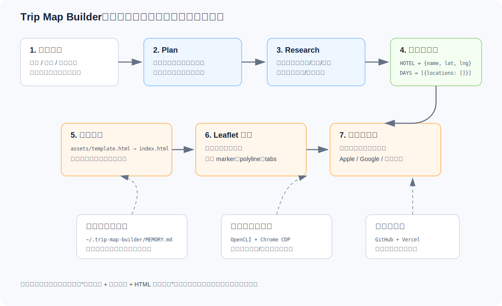

# README_SELF：快速上手与代码逻辑说明

这份文档是给“第一次打开本仓库、想尽快跑出一个旅行地图页”的开发者看的。原仓库本质上是一个 **AI Skill + 单文件 HTML 地图模板**，不是传统 npm/python 应用；当前没有 `package.json`、没有启动脚本、也没有必须配置的 API Key。




## 0. 仓库归档结构

这个 fork 已经改成“通用工作流 + 按目的地归档”的结构：

```text
memory/                         # 长期可复用旅行偏好
  traveler_profile.md
trips/                          # 每次旅行一个目录
  2606_wuhan/
    requirements.md             # 本次旅行个性化需求，短期记忆
    research.md                 # 调研记录和待复核事项
    itinerary.md                # 人类可读每日行程
    trip_data.js                # HOTEL + DAYS 结构化数据
    index.html                  # 本次旅行地图页
assets/template.html            # 通用地图模板
references/                     # 通用规划与调研方法论
index.html                      # 旅行列表首页
```

新增目的地时，优先创建 `trips/YYMM_destination/`，例如 `trips/2607_chengdu/`。长期偏好写进 `memory/traveler_profile.md`，单次偏好写进该旅行目录的 `requirements.md`。

## 1. 最快怎么用起来

### 1.1 推荐运行环境

- 系统：Windows/macOS/Linux 均可；本文命令以 Windows PowerShell 为例。
- Python：可选，仅用于本地静态服务预览，建议 Python 3.x。
- Node/OpenCLI：可选，仅在要按文档执行大众点评/小红书调研时需要。
- 浏览器：建议 Chrome/Edge。地图页会从 CDN 加载 Leaflet 与 CARTO 瓦片，完整预览需要联网。

本地可验证：复制模板或复用某个 `trips/<trip_id>/index.html`、填入 `HOTEL`/`DAYS`、打开该旅行目录下的 `index.html`、查看时间线和页面结构。

必须联网或依赖外部服务：Leaflet/CARTO CDN 地图瓦片、大众点评/小红书调研、GitHub/Vercel 部署。当前仓库没有必须填写的 API Key；若后续接入 geocoding、LLM 或第三方地图服务，再按新增脚本说明配置密钥。

### 1.2 先看哪些文件

| 文件 | 作用 | 你需要改什么 |
|---|---|---|
| `SKILL.md` | Skill 入口，定义 Plan → Research → Build 总流程 | 通常不直接改，先读它理解工作方式 |
| `references/trip-planning.md` | 行程规划方法论 | 按里面的输入模板收集用户信息 |
| `references/dianping-research.md` | 大众点评调研流程 | 需要餐厅信号时按命令和判断标准执行 |
| `references/xhs-research.md` | 小红书调研流程 | 需要近期体验/氛围信号时使用 |
| `assets/template.html` | 最终地图页模板 | 复制到 `trips/<trip_id>/index.html`，填 `HOTEL`、`DAYS`、总览内容 |

### 1.3 最小可运行流程

1. 复制地图模板：

```powershell
Copy-Item .\assets\template.html .\index.html
```

2. 打开 `index.html`，找到这两段并填数据：

```js
const HOTEL = { name: 'Hotel Name', lat: 0, lng: 0 };

const DAYS = [
  { id: 0, label: '总览', color: '#0071e3', locations: [] },
  // 每天一个对象，每个地点必须有 name、lat、lng、type、time、desc
];
```

地点对象的核心字段：

```js
{
  name: '地点名',
  lat: 35.68,
  lng: 139.77,
  type: 'spot', // food | spot | drink | hotel | transport
  time: '10:30',
  desc: '为什么去、怎么玩',
  budget: '可选预算',
  detail: '可选详情',
  xhsKeyword: '可选小红书搜索词',
  dianpingKeyword: '可选大众点评搜索词',
  reserve: '可选预约链接',
  gmap: '可选 Google Maps 查询词'
}
```

3. 修改 `overviewContent()` 里的标题、酒店、航班、交通卡、预算、支付提醒等总览信息。

4. 双击 `index.html` 即可预览。更稳一点可以在仓库目录启动静态服务：

```powershell
python -m http.server 8000
```

然后打开 `http://localhost:8000/` 查看旅行列表，或打开 `http://localhost:8000/trips/2606_wuhan/` 查看武汉地图页。

### 1.4 API Key、路径、依赖说明

- 地图底图：不需要 API Key。模板用 Leaflet + CARTO CDN：

```js
L.tileLayer('https://{s}.basemaps.cartocdn.com/light_all/{z}/{x}/{y}{r}.png', { maxZoom: 19 }).addTo(map);
```

- 共享记忆：可选路径是 `~/.trip-map-builder/MEMORY.md`。没有这个文件也能正常使用。
- 大众点评/小红书调研：可选依赖 OpenCLI 和 Chrome 登录态，不是生成 HTML 的必需项。
- 部署：可选用 GitHub + Vercel。仓库没有内置部署脚本。

## 2. 主要功能和执行逻辑

### 2.1 Skill 层：规划、调研、生成

`SKILL.md` 定义了三段流水线：

1. **Plan**：抽取日期、航班、酒店、愿望清单等硬约束；按区域组织；删掉塞不下或风险高的点。
2. **Research**：餐厅用大众点评看口味、排队、价格和踩雷；用小红书补氛围、近期体验和软提醒。
3. **Build**：把结构化地点填入 `assets/template.html`，生成移动端友好的地图页。

这个仓库的核心思路是：行程不是越满越好，而是越顺越好。餐厅默认是当天区域里的补给点，不应该为了名店反向扭曲整天路线。

### 2.2 模板层：数据驱动地图

`assets/template.html` 里真正驱动页面的是 `HOTEL` 和 `DAYS`：

```js
const HOTEL = { name: 'Hotel Name', lat: 0, lng: 0 };
const DAYS = [
  { id: 0, label: '总览', color: '#0071e3', locations: [] }
];
```

页面初始化时会创建 Leaflet 地图，并加载真实瓦片底图：

```js
const map = L.map('map', {
  center: [HOTEL.lat || 35.69, HOTEL.lng || 139.74],
  zoom: 12,
  zoomControl: false,
  attributionControl: true
});
L.tileLayer('https://{s}.basemaps.cartocdn.com/light_all/{z}/{x}/{y}{r}.png', { maxZoom: 19 }).addTo(map);
```

用户点击不同日期 tab 时，`go(idx)` 会刷新内容区并调用 `showDay(idx)`：

```js
function go(idx) {
  contentEl.innerHTML = idx===0 ? overviewContent() : renderDay(idx);
  showDay(idx);
}
```

`showDay(idx)` 负责在地图上画点和当天路线：

```js
const m = L.marker([l.lat,l.lng], { icon: icon(day.color, emojis[l.type]||'📌') }).addTo(map);
const pl = L.polyline(coords, { color:day.color, weight:2.5, opacity:.5, dashArray:'6,5' }).addTo(map);
```

`locCard(loc, dayIdx)` 负责生成下方时间线卡片，包括导航、小红书、大众点评、预约按钮。

### 2.3 调研层：文档指导而非自动脚本

当前仓库没有自动采集脚本，`references/dianping-research.md` 和 `references/xhs-research.md` 是操作指南。比如大众点评建议用：

```bash
opencli dianping search "银座 午餐" --city 东京 --limit 5 -f json
opencli dianping shop <shop_id> -f json
```

小红书建议用 Chrome CDP，直接进入搜索结果页，而不是模拟输入框：

```js
await bridge.send('Page.navigate', {
  url: 'https://www.xiaohongshu.com/search_result?keyword=' + encodeURIComponent(query)
});
```

## 3. 它解决了什么问题

这个仓库解决的是：旅行规划信息很散，最后很难变成一份“手机上能直接用”的地图化行程。它的解法是把工作拆成三层：

- 用规划方法论把用户输入变成顺路、可执行的每日区域安排。
- 用大众点评和小红书给餐厅/店铺补充真实世界信号。
- 用 Leaflet 模板把地点、时间线、导航入口做成一个可部署的 HTML 页面。

它最强的地方是“把规划结果可视化”。只要经纬度和地点数据填好，模板就能快速给出真实地图、每日 marker、路线虚线和移动端导航按钮。

## 4. 还没解决、值得继续优化的点

- **没有自动地理编码**：地点名到经纬度需要人工查，容易错。可以增加 geocode 脚本和坐标校验。
- **没有一键生成脚本**：现在要手工复制模板、填 JS 数据。可以新增 `trip_data.json` → `index.html` 的生成器。
- **没有静态地图截图**：当前是交互 HTML。若要嵌入报告，需要 Playwright 截图或地图导出脚本。
- **目的地发现能力弱**：更适合处理已有 wishlist，不擅长从“只给目的地”自动发现景点、美食和路线。
- **地区泛化不足**：模板里有 Tokyo fallback，日本支付方式也偏多；做通用旅游规划 Skill 时应按目的地切换地图、餐饮和支付平台。
- **调研依赖手工流程**：大众点评/小红书部分是指南，不是稳定自动化模块。后续可以封装 OpenCLI/CDP 辅助脚本。

## 5. 后续最应该关注的 3 个文件

1. `assets/template.html`：地图页面的实际运行核心，所有 marker、polyline、tab、时间线和导航按钮都在这里。
2. `SKILL.md`：定义 Skill 触发、Plan → Research → Build 总流程，以及哪些 reference 应该在什么时候读。
3. `references/trip-planning.md`：决定行程质量的方法论文件，包含输入模板、取舍原则、每日区域安排和用户交互格式。

## 6. 推荐的二次开发方向

如果要在这个仓库基础上继续开发，优先顺序建议是：

1. 增加 `trip_data.json`，让行程数据脱离 HTML。
2. 增加 `scripts/build_map.py` 或 `scripts/build_map.js`，自动把数据注入模板。
3. 增加 `scripts/geocode_places.*`，批量补经纬度并做人类确认。
4. 增加 `scripts/screenshot_map.*`，输出可嵌入报告的真实地图 PNG。
5. 把目的地发现、景点核验、餐厅调研拆成更细的 references 和可选脚本。


